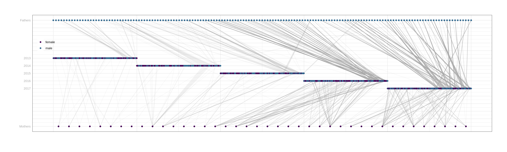
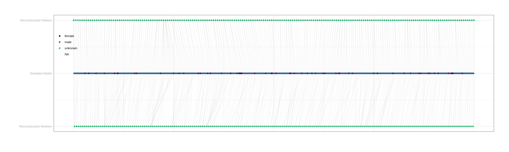

# Salmon Parentage Assignment Pipeline

## Data prep

Data location: ```/home/DATA/salmon_parentage_analysis```

Files used: ``` GenoScoreNUM_Annukka_set3_NextSeq-20190619.txt```, ```GenoScoreNUM_NextSeq-20190416.txt```

```bash
ln -s /home/DATA/salmon_parentage_analysis sal_parentage
```

The data was prepared with:

```bash
python snp_data_prep.py
```

The raw data from Kenyon was preprocessed to extract UTS samples and male controls. Loci with more than 40% 'NA's were 
removed, along with the SDY locus, list of removed loci: [removed_loci.csv](removed_loci.csv). Individuals with more than
60% missing genotypes were also removed: [removed_indivs.csv](removed_indivs.csv). The male controls were used to estimate
a per locus error rate: [marker_summary.csv](marker_summary.csv). The cleaned data was written to: 
[uts_sal_allruns.filtered.csv](uts_sal_allruns.filtered.csv).

Input ```.dat``` files for colony was generated as follows:

```bash
python create_dat_file.py -geno uts_sal_allruns.filtered.csv -marks marker_summary.csv > uts_salmon.dat
python create_dat_file.py -geno uts_sal_allruns.filtered.csv -marks marker_summary.csv > uts_salmon_mediumrun.dat
python create_adult_dat.py -geno uts_sal_allruns.filtered.csv -marks marker_summary.csv > uts_salmon_adults_mediumrun.dat
```

## Running Colony2

Colony2 was run as follows:

### Juveniles vs Adults

<!---

Quick run:

```bash
mkdir sal_parentage/colony_out
cd sal_parentage/colony_out/
mpirun -np 7 ~/colony2/colony2p.ifort.impi2015.out IFN:/home/hbarton/salmon_parentage/uts_salmon.dat &> uts_sal_colony.log.txt &
```


Medium run (competing with sharc): 

```bash
mkdir sal_parentage/colony_out_medium
cd sal_parentage/colony_out_medium
mpirun -np 4 ~/colony2/colony2p.ifort.impi2015.out IFN:/home/hbarton/salmon_parentage/uts_salmon_mediumrun.dat &> uts_sal_colony_mdeium.log.txt &
```


Colony2 runs on sharc

--->

```bash
mkdir /fastdata/bop15hjb/sal_colony
./run_colony.py -in_dat /home/bop15hjb/salmon_parentage/uts_salmon_mediumrun.dat -np 28
cp /fastdata/bop15hjb/sal_colony_adults_medium/uts_salmon_adults.BestConfig_Ordered ./
```

### Adults

```bash
mkdir /fastdata/bop15hjb/sal_colony_adults_medium
./run_colony.py -in_dat /home/bop15hjb/salmon_parentage/uts_salmon_adults_mediumrun.dat -np 24 -out_dir /fastdata/bop15hjb/sal_colony_adults_medium/
cp /fastdata/bop15hjb/sal_colony_adults_medium/uts_salmon_adults.BestConfig_Ordered ./
cat uts_salmon_adults.BestConfig_Ordered | python add_reconstuct_prefix.py gp > uts_salmon_adults.BestConfig_Ordered.uniquenames.txt
```

### Processing and Cleaning

List of clones: [duplicates.csv](duplicates.csv)

```bash
grep ',' /fastdata/bop15hjb/sal_colony*/*BestClone | tr -s ' ' | cut -d ' ' -f 4 | grep U > duplicates.csv
python colony2ped.py -in_dat uts_salmon.BestConfig_Ordered -in_dat uts_salmon_adults.BestConfig_Ordered.uniquenames.txt -geno uts_sal_allruns.filtered.csv -duplicates duplicates.csv > uts_ped.csv 
```


## Visualising data

A pedigree csv was built from the colony output and sex added in using the SDY genotypes in the filtered calls and birth 
year was estimated based on ID, adults were arbitrarily assigned a 5 year stint in freshwater.  

Pedigree with reconstructed grand parents:

```bash
cat uts_ped.csv | python recode_dates.py -f_off 2 -m_off 2 -u_off 2 -f_p 1 -m_p 1 -u_p 1 -f_g 0 -m_g 0 | grep -v ^* | grep -v ^# > uts_ped_gens_plot.csv 
Rscript plot_ped.R 
```


Mothers and fathers split for clarity:

```bash
cat uts_ped.csv | python recode_dates.py -f_p 2022 -m_p 2008 -f_g rm m_g rm | grep -v ^* | grep -v ^# > uts_ped_split_parents_plotdata.csv
Rscript plot_dam_sire_off.R 
```



Grandparents and parents:

```bash
cat uts_ped.csv | python recode_dates.py -f_off rm -m_off rm -u_off rm -f_p 1 -m_p 1 -u_p 1 -m_g 0 -f_g 2 | grep -v ^* | grep  -v ^# > uts_ped_gp_v_p.csv
Rscript plot_grandparents.R
```

