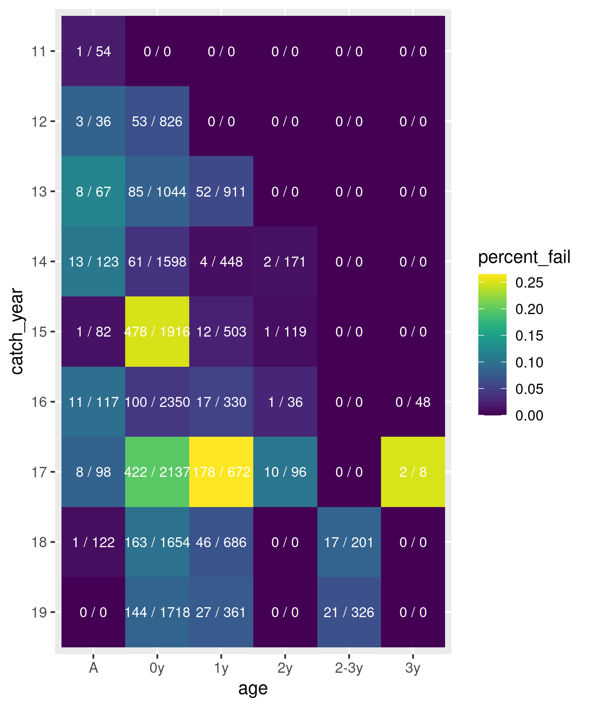

# Salmon Parentage Assignment Pipeline

Data file: ```UtsSNPMasterDataKM_20.11.24.csv```

## Data prep

Linked loci were identified:

```shell script
Rscript id_linked_markers.R UtsSNPMasterDataKM_20.11.24.csv
```

Output:
```
Warning message:
In LD.data.frame(geno_coded) :
  Non-genotype variables or genotype variables with more or less than two alleles detected. These variables will be omitted: SDY_ion2
                  Locus1             Locus2         r
30276           AKAP11_4 c25_684F_713R_SACa 0.6717277
30451           AKAP11_4 c25_684F_713R_SACb 0.6717277
30624 c25_684F_713R_SACa c25_684F_713R_SACb 0.9997091
352        UtagF_SS_147a      UtagF_SS_148c 0.8592247
702        UtagF_SS_147a       c25_1441_SAC 0.6866607
703        UtagF_SS_148c       c25_1441_SAC 0.8377466
25413              X21_1             TN_301 0.6286910
```

Second column markers flagged for removal

```shell script
printf 'c25_684F_713R_SACa\nc25_684F_713R_SACb\nUtagF_SS_148c\nc25_1441_SAC\nTN_301\n' > linked_markers_toremove.txt
```

The data was then prepared with:

```bash
python snp_data_prep.py -in_file UtsSNPMasterDataKM_20.11.24.csv -miss 0.05
python lifehist_prep.py -filtered_csv 2021-06-18.uts_sal_allruns.filtered.csv -adult_csv Uts_Birthyear_Calc_21_06_16.csv
```

The data from Kenyon was preprocessed to remove loci with more than 40% 'NA's, and those identified above, 
list of removed loci: [2021-06-18.removed_loci.csv](2021-06-18/2021-06-18.removed_loci.csv). Individuals with more than
5% missing genotypes were also removed: [2021-06-18.removed_indivs.csv](2021-06-18/2021-06-18.removed_indivs.csv). A list of all samples processed: 
[2021-06-18.all_samples_process.txt](2021-06-18/2021-06-18.all_samples_process.txt). The cleaned data was written to: 
[2021-06-18.uts_sal_allruns.filtered.csv](2021-06-18/2021-06-18.uts_sal_allruns.filtered.csv).

<!---
The male controls were used to estimate a per locus error rate: [marker_summary.csv](marker_summary.csv). The cleaned data was written to: 
[uts_sal_allruns.filtered.csv](uts_sal_allruns.filtered.csv).
--->

Failed samples were summarised:

```bash
python sample_success_summary.py 2021-06-18.all_samples_process.txt 2021-06-18.removed_indivs.csv > sample_success_data.csv
Rscript sample_success_heatmap.R 
```



## Generating main input file and running sequoia

Ran sequoia with 3 different age prior approaches. The default age priors, modified priors with age gaps of 3 or less 
set as not possible (age prior to 0) for females and 

```bash
python recode_geno_rm_sdy.py -geno 2021-06-18.uts_sal_allruns.filtered.csv > 2021-06-18.uts_sal_allruns.filtered.nosdy_recode.csv
Rscript assign_parents_sequoia.R --geno 2021-06-18.uts_sal_allruns.filtered.nosdy_recode.csv --hist 2021-06-18.uts_lifehist.csv --out_tag uts_default --prior_type 0 &> uts_default.log &
Rscript assign_parents_sequoia.R --geno 2021-06-18.uts_sal_allruns.filtered.nosdy_recode.csv --hist 2021-06-18.uts_lifehist.csv --out_tag uts_informed --prior_type 1 &> uts_informed.log &
Rscript assign_parents_sequoia.R --geno 2021-06-18.uts_sal_allruns.filtered.nosdy_recode.csv --hist 2021-06-18.uts_lifehist.csv --out_tag uts_conservative --prior_type 2 &> uts_conservative.log &
```

# Visualising parentage assignment

Assignments were summarised for each run:

```shell
cat 2021-06-18.uts_default.prior0.parents.csv | python parents2plot.py > 2021-06-18.uts_default.prior0.parents.plotable.csv
cat 2021-06-18.uts_informed.prior1.parents.csv | python parents2plot.py > 2021-06-18.uts_informed.prior1.parents.plotable.csv
cat 2021-06-18.uts_conservative.prior2.parents.csv | python parents2plot.py > 2021-06-18.uts_conservative.prior2.parents.plotable.csv

Rscript visualise_assignment.R --parents 2021-06-18.uts_default.prior0.parents.plotable.csv --out 2021-06-18.uts_default.prior0.assignment_plots.pdf
Rscript visualise_assignment.R --parents 2021-06-18.uts_informed.prior1.parents.plotable.csv --out 2021-06-18.uts_informed.prior1.assignment_plots.pdf
Rscript visualise_assignment.R --parents 2021-06-18.uts_conservative.prior2.parents.plotable.csv --out 2021-06-18.uts_conservative.prior2.assignment_plots.pdf
```

# Tidying data

Run moved to its own dated directory. Old runs in their own directories

```shell
mkdir 2021-06-18/
mv 2021-06-18.* 2021-06-18/
mv *.log 2021-06-18/
```